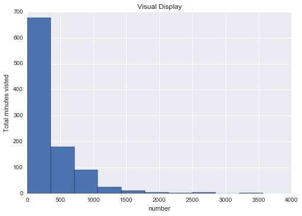
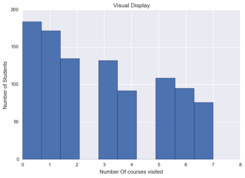
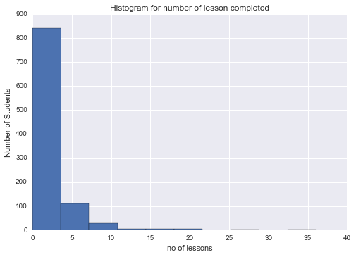

#  Data Analysis_1


By: Anish Kumar  
 [My Github profile](https://github.com/Anish-kr)

In this project,my aim is to analyse the three csv files-
* Enrollment.csv
* Engagement.csv
* project_submission.csv

These files include the enrollment data, engagement data and project submissions data of the students of Udacity. 


This project involves basic analysis in python.

Let's start with importing all the required libraries


```python
import unicodecsv
from datetime import datetime as dt

%pylab inline
import matplotlib.pyplot as plt


```

    Populating the interactive namespace from numpy and matplotlib
    

Next let us import all the data and store in a suitable variable.  
For this let us define a function that shall ease our work. 


```python

def read_csv(filename):
    with open(filename,'rb') as f:
        reader= unicodecsv.DictReader(f)
        return list(reader)
        
```

Now importing data using the defined function


```python
enrollments= read_csv('enrollments.csv')
daily_engagements= read_csv('daily_engagement.csv')
project_submissions= read_csv('project_submissions.csv')


```

Let us a print a sample of the read data


```python
print enrollments[0]  
```

    {u'status': u'canceled', u'is_udacity': u'True', u'is_canceled': u'True', u'join_date': u'2014-11-10', u'account_key': u'448', u'cancel_date': u'2015-01-14', u'days_to_cancel': u'65'}
    


```python
print daily_engagements[0]  
```

    {u'lessons_completed': u'0.0', u'num_courses_visited': u'1.0', u'total_minutes_visited': u'11.6793745', u'projects_completed': u'0.0', u'acct': u'0', u'utc_date': u'2015-01-09'}
    


```python
print project_submissions[0]
```

    {u'lesson_key': u'3176718735', u'processing_state': u'EVALUATED', u'account_key': u'256', u'assigned_rating': u'UNGRADED', u'completion_date': u'2015-01-16', u'creation_date': u'2015-01-14'}
    

But we find that all values are by default string values which is not suitable. We'll have to fix their datatypes as required.


```python
#defining function for fixing date datatypes
def parse_date(date):
    if date=='':
        return None
    else:
        return dt.strptime(date, '%Y-%m-%d' )
    
    
#function for fixing integer datatypes
def parse_maybe_int(i):
    if i=='':
        return None
    else:
        return int(i)   


```


```python
for enrollment in enrollments:
    enrollment['cancel_date'] = parse_date(enrollment['cancel_date'])
    enrollment['days_to_cancel'] = parse_maybe_int(enrollment['days_to_cancel'])
    enrollment['is_canceled'] = enrollment['is_canceled'] == 'True'
    enrollment['is_udacity'] = enrollment['is_udacity'] == 'True'
    enrollment['join_date'] = parse_date(enrollment['join_date'])
    
```


```python
# Clean up the data types in the engagement table
for engagement_record in daily_engagements:
    engagement_record['lessons_completed'] = int(float(engagement_record['lessons_completed']))
    engagement_record['num_courses_visited'] = int(float(engagement_record['num_courses_visited']))
    engagement_record['projects_completed'] = int(float(engagement_record['projects_completed']))
    engagement_record['total_minutes_visited'] = float(engagement_record['total_minutes_visited'])
    engagement_record['utc_date'] = parse_date(engagement_record['utc_date'])
```


```python
# Clean up the data types in the submissions table
for submission in project_submissions:
    submission['completion_date'] = parse_date(submission['completion_date'])
    submission['creation_date'] = parse_date(submission['creation_date'])
```


```python
print enrollments[0]
print daily_engagements[0]
print project_submissions[0]
```

    {u'status': u'canceled', u'is_udacity': True, u'is_canceled': True, u'join_date': datetime.datetime(2014, 11, 10, 0, 0), u'account_key': u'448', u'cancel_date': datetime.datetime(2015, 1, 14, 0, 0), u'days_to_cancel': 65}
    {u'lessons_completed': 0, u'num_courses_visited': 1, u'total_minutes_visited': 11.6793745, u'projects_completed': 0, u'acct': u'0', u'utc_date': datetime.datetime(2015, 1, 9, 0, 0)}
    {u'lesson_key': u'3176718735', u'processing_state': u'EVALUATED', u'account_key': u'256', u'assigned_rating': u'UNGRADED', u'completion_date': datetime.datetime(2015, 1, 16, 0, 0), u'creation_date': datetime.datetime(2015, 1, 14, 0, 0)}
    


```python
print len(enrollments)
print len(daily_engagements)
print len(project_submissions)
```

    1640
    136240
    3642
    


```python
#Equalizing the header namein all lists
for data in daily_engagements:
    data['account_key']= data['acct']
    del[data['acct']]
```


```python
#to make sure the change is applied
daily_engagements[0]['account_key']
```


    u'0'


***********************************************************************************************************************


**Now let us see what questions can we answer using this data**  
 1) How long does it take students to submit their first project?  
 2) How do students who pass differ from those who don't ?  
 3) On an average How many lessons were completed by those who passed?  
 4) what was the daily engagement ofthose who passed?  
 5) Which all lessons were surely taken up by those who passed?  
 6) Which lessons were taken by those who could not complete?    
 7) In which month most students passed?  
 8) In which year most students passed?  
 9) How many were such students who passed with distinction?  
 10) What ws the peculiarity about them?  
 

These are some of the many question we can answer using the obtained data. Let us try to solve them one by one.

** But first we'll have to make sure that there are no unwanted data in our dataset! For that let us first investigate our dataset and look for any surprising points**

#### Data cleaning Phase


```python
#First finding the unique no of students enrolled. As one particular student may have enrolled and 
#again cancelled and agian enrolled. So it's important we find the unique no.

def unique_students(data):
    uni_st = set()
    for datapoint in data:
        uni_st.add(datapoint['account_key'])
    return uni_st

print "Unique_enrolled_Students",len(unique_students(enrollments))
print "Unique_no_of_projects_submitted",len(unique_students(project_submissions))
print "Unique_no_of_students_engaged",len(unique_students(daily_engagements))
```

    Unique_enrolled_Students 1302
    Unique_no_of_projects_submitted 743
    Unique_no_of_students_engaged 1237
    


```python
Unique_enrolled_Students = unique_students(enrollments)
Unique_no_of_projects_submitted=unique_students(project_submissions)
Unique_no_of_students_engaged=unique_students(daily_engagements)


```

Notice that the number of unique students engaged is different from the no unique students enrolled that is not good. Something is different than expected. Let us investigate as to how the difference is coming up.

Let us find the suprising data points. The students who are enrolled but not engaged.


```python
for enrollment in enrollments:
    student= enrollment['account_key']
    if student not in Unique_no_of_students_engaged:
        print enrollment
        break
        
        

```

    {u'status': u'canceled', u'is_udacity': False, u'is_canceled': True, u'join_date': datetime.datetime(2014, 11, 12, 0, 0), u'account_key': u'1219', u'cancel_date': datetime.datetime(2014, 11, 12, 0, 0), u'days_to_cancel': 0}
    

This we found that one major reason as to why this happening was beacause some student enrolled and cancelled on the same day. But this really not a problem. However, we should know that such a data exists!

Now, we'll check if any other surprising data points exist.


```python
num_of_prob = 0
for enrollment in enrollments:
    student = enrollment['account_key']
    if student not in Unique_no_of_students_engaged and (enrollment['join_date'] != enrollment['cancel_date']):
        num_of_prob = num_of_prob+1
        

        
print num_of_prob
```

    3
    

Since Only three surprising records left, Let us print all of them.


```python
for enrollment in enrollments:
    student = enrollment['account_key']
    if student not in Unique_no_of_students_engaged and (enrollment['join_date'] != enrollment['cancel_date']):
        print enrollment
        

        

```

    {u'status': u'canceled', u'is_udacity': True, u'is_canceled': True, u'join_date': datetime.datetime(2015, 1, 10, 0, 0), u'account_key': u'1304', u'cancel_date': datetime.datetime(2015, 3, 10, 0, 0), u'days_to_cancel': 59}
    {u'status': u'canceled', u'is_udacity': True, u'is_canceled': True, u'join_date': datetime.datetime(2015, 3, 10, 0, 0), u'account_key': u'1304', u'cancel_date': datetime.datetime(2015, 6, 17, 0, 0), u'days_to_cancel': 99}
    {u'status': u'current', u'is_udacity': True, u'is_canceled': False, u'join_date': datetime.datetime(2015, 2, 25, 0, 0), u'account_key': u'1101', u'cancel_date': None, u'days_to_cancel': None}
    

On enquiring,we realize that these are Udacity test accounts. We'll have to remove them from our dataset anyway.


```python
test_acc=set()
for enrollment in enrollments:
    if enrollment['is_udacity']:
        test_acc.add(enrollment['account_key'])
    
print len(test_acc)

```

    6
    

These are also unwanted data that have to be removed from our data before we start our analysis.  
Let us start with removing all these unwanted data from our dataset.

Removing the Udacity test accounts


```python
#let us define a function for the same

def remove_test_account(data):
    new_list=[]
    for datapoint in data:
        if datapoint['account_key'] not in test_acc:
            new_list.append(datapoint)
    return new_list

non_udacity_enrollments = remove_test_account(enrollments)
non_udacity_daily_engagements = remove_test_account(daily_engagements)
non_udacity_project_submissions = remove_test_account(project_submissions)          


        
        
```


```python
non_udacity_enrollments[0] 

```


    {u'account_key': u'700',
     u'cancel_date': datetime.datetime(2014, 11, 16, 0, 0),
     u'days_to_cancel': 6,
     u'is_canceled': True,
     u'is_udacity': False,
     u'join_date': datetime.datetime(2014, 11, 10, 0, 0),
     u'status': u'canceled'}


```python
non_udacity_daily_engagements[0]

```


    {'account_key': u'0',
     u'lessons_completed': 0,
     u'num_courses_visited': 1,
     u'projects_completed': 0,
     u'total_minutes_visited': 11.6793745,
     u'utc_date': datetime.datetime(2015, 1, 9, 0, 0)}


```python
non_udacity_project_submissions[0]          

```


    {u'account_key': u'256',
     u'assigned_rating': u'UNGRADED',
     u'completion_date': datetime.datetime(2015, 1, 16, 0, 0),
     u'creation_date': datetime.datetime(2015, 1, 14, 0, 0),
     u'lesson_key': u'3176718735',
     u'processing_state': u'EVALUATED'}


```python
print len(non_udacity_enrollments)
print len(non_udacity_daily_engagements)
print len(non_udacity_project_submissions)

```

    1622
    135656
    3634
    

### Now that we have cleaned our data, Let us start with dealing with the questions.

  1) **How total_minutes_visited differ for the students who pass the first project versus those who don't?**

But there is problem that underlies the investigation of this question that we'll have to take care of.   
* There is a certain time gap between project submission and result being given
* Each person takes different amount of time to complete the project. So Our comparision is being done for different length of time for diffrent person.
* Person engaged could have been involved in project other than the first project.

To compensate the problems let us consider only the paid students that too only their engagement for the first week.


```python
#Extracting the list of paid students

paid_students={}

for enrollment in non_udacity_enrollments:
        if not enrollment['is_canceled'] or enrollment['days_to_cancel']>7:
            account_key= enrollment['account_key']
            enrollment_date= enrollment['join_date']
            paid_students[account_key]= enrollment_date


# no of paid students
len(paid_students)
```


    995


```python

for enrollment in non_udacity_enrollments:
        if not enrollment['is_canceled'] or enrollment['days_to_cancel']>7:
            account_key= enrollment['account_key']
            enrollment_date= enrollment['join_date']
            
            if account_key not in paid_students or enrollment_date > paid_students[account_key]:
                    paid_students[account_key] = enrollment_date
                    
len(paid_students)
```


    995


Now let us look at the number of engagegmets that too place for these students within first week of joining.


```python
def within_first_week(engagement_date, join_date):
    time_delta = engagement_date - join_date
    return time_delta.days < 7 and time_delta.days >=0

```


```python

def remove_free_trial(data):
    new_list = []
    for data_point in data:
        account_key = data_point['account_key']
        if account_key in paid_students:
            new_list.append(data_point)
    return new_list


            
```


```python
paid_enrollments = remove_free_trial(non_udacity_enrollments)
paid_engagements = remove_free_trial(non_udacity_daily_engagements)
paid_submissions = remove_free_trial(non_udacity_project_submissions)

print len(paid_enrollments)
print len(paid_engagements)
print len(paid_submissions)
```

    1293
    134549
    3618
    


```python
#i=2
#for data in paid_enrollments:
#    print data
#    i=i-1
#    if (i==0):
#        break
        
print paid_enrollments[0]
print paid_engagements[0]
##NOte how we are referring to the list of dictionaries!! EIther ways Ok!!
```

    {u'status': u'canceled', u'is_udacity': False, u'is_canceled': True, u'join_date': datetime.datetime(2014, 11, 10, 0, 0), u'account_key': u'429', u'cancel_date': datetime.datetime(2015, 3, 10, 0, 0), u'days_to_cancel': 120}
    {u'lessons_completed': 0, u'num_courses_visited': 1, u'total_minutes_visited': 11.6793745, u'projects_completed': 0, 'account_key': u'0', u'utc_date': datetime.datetime(2015, 1, 9, 0, 0)}
    


```python
paid_engagement_in_first_week= []

for engagement in paid_engagements:
    account_key = engagement['account_key']
    engagement_date= engagement['utc_date']
    join_date = paid_students[account_key]
    if within_first_week(engagement_date,join_date):
        paid_engagement_in_first_week.append(engagement)
        
len(paid_engagement_in_first_week)
```


    6919


```python
for engagement in paid_engagement_in_first_week:
    if engagement['num_courses_visited']:
        engagement['have_visited'] = 1
    else:
        engagement['have_visited']= 0
        
```


```python
paid_engagement_in_first_week[0]
```


    {'account_key': u'0',
     'have_visited': 1,
     u'lessons_completed': 0,
     u'num_courses_visited': 1,
     u'projects_completed': 0,
     u'total_minutes_visited': 11.6793745,
     u'utc_date': datetime.datetime(2015, 1, 9, 0, 0)}


```python
from collections import defaultdict

engagement_by_account= defaultdict(list)
for engagement_record in paid_engagement_in_first_week:
    account_key = engagement_record['account_key']
    engagement_by_account[account_key].append(engagement_record)
    

    
 
            

    
    
```


```python
total_minutes_by_account = {}

for account_key, engagement_for_student in engagement_by_account.items():
    total_minutes= 0
    for engagement_record in engagement_for_student:
        total_minutes += engagement_record['total_minutes_visited']
    total_minutes_by_account[account_key]=(total_minutes)
    


```


```python
# Extracting only the values from the dictionary 
total_minutes = total_minutes_by_account.values()


```


```python
import numpy as np

print "Mean Value",np.mean(total_minutes)
print "Standard Deviation Value",np.std(total_minutes)
print "Min Value",np.min(total_minutes)
print "Max Value",np.max(total_minutes)
```

    Mean Value 306.708326753
    Standard Deviation Value 412.996933409
    Min Value 0.0
    Max Value 3564.7332645
    


```python
no_prob =0
for engagement in paid_engagement_in_first_week:
    account_key = engagement['account_key']
    if total_minutes_by_account[account_key] > 10080:
        no_prob += no_prob+1
        
        
print no_prob
```

    0
    

## Now I'll try to analyze the the lessons completed.


```python
# 
engagement_by_account_lessons = defaultdict(list)
for engagement in paid_engagement_in_first_week:
    account_key = engagement['account_key']
    engagement_by_account_lessons[account_key].append(engagement['lessons_completed'])
    

```


```python
total_lessons_completed= {}


for account_key,lesson_list in engagement_by_account_lessons.items():
    total_lessons= 0
    for data in lesson_list:
        total_lessons += data
        total_lessons_completed[account_key]= total_lessons
        
    
 
```


```python
print "mean",np.mean(total_lessons_completed.values())
print "standard deviation value",np.std(total_lessons_completed.values())
print "min no",np.min(total_lessons_completed.values())
print "Max value",np.max(total_lessons_completed.values())
```

    mean 1.63618090452
    standard deviation value 3.00256129983
    min no 0
    Max value 36
    

### Let me create a function for the same.


```python
def group_by_acc(data,key1):
    engagement_by_account = defaultdict(list)
    for engagement in data:
        account_key = engagement['account_key']
        engagement_by_account[account_key].append(engagement[key1])
    
    total_counts= {}
    for account_key, engagement_record in engagement_by_account.items():
        total_count = 0
        for point in engagement_record:
            total_count +=point
        total_counts[account_key]= total_count
        
    return total_counts


def draw_hist(x,title1,ylabel1,xlabel1):
    plt.hist(x)
    # Chart title
    plt.title(title1)
    plt.xlabel(xlabel1)
    plt.ylabel(ylabel1)

    

import seaborn as sns
def summarize(all_values, key_value,title,ylabel1,xlabel1):
    print "For ",key_value," "
    print "The Mean Value is              :",np.mean(all_values)
    print "The Standard Deviation Value is:",np.std(all_values)
    print "The Minimum Value is           :",np.min(all_values)
    print "The Maximum Value is           :",np.max(all_values)
    draw_hist(all_values,title,ylabel1,xlabel1)
    print "                                      "
    
       
summarize(  (group_by_acc(paid_engagement_in_first_week,'total_minutes_visited').values()) ,'total_minutes_visted','Visual Display','Total minutes visted','number')

```

    For  total_minutes_visted  
    The Mean Value is              : 306.708326753
    The Standard Deviation Value is: 412.996933409
    The Minimum Value is           : 0.0
    The Maximum Value is           : 3564.7332645
                                          
    





```python
summarize(group_by_acc(paid_engagement_in_first_week,'have_visited').values(),'have_visited','Visual Display','Number of Students','Number Of courses visited')
```

    For  have_visited  
    The Mean Value is              : 2.86733668342
    The Standard Deviation Value is: 2.25519800292
    The Minimum Value is           : 0
    The Maximum Value is           : 7
                                          
    





```python
summarize(group_by_acc(paid_engagement_in_first_week,'lessons_completed').values(),'lessons_completed','Histogram for number of lesson completed','Number of Students','no of lessons')
```

    For  lessons_completed  
    The Mean Value is              : 1.63618090452
    The Standard Deviation Value is: 3.00256129983
    The Minimum Value is           : 0
    The Maximum Value is           : 36
                                          
    





```python

passing_engagement=set()
non_passing_engagement=set() 

subway_project_submission_keys = ['746169184','3176718735']

for data in paid_submissions:
    account_key = data['account_key']
    if data['lesson_key'] in subway_project_submission_keys:
        if data['assigned_rating']== 'UNGRADED' or data['assigned_rating']== 'INCOMPLETE':
            non_passing_engagement.add(account_key)
        else:
            passing_engagement.add(account_key)
            
print len(passing_engagement)
print len(non_passing_engagement)
```

    647
    481
    


```python
passing_engagement1=[]
non_passing_engagement1=[]

for data in paid_engagement_in_first_week:
    if data['account_key'] in passing_engagement:
        passing_engagement1.append(data)
    else:
            non_passing_engagement1.append(data)
                
print len(passing_engagement1)
print len(non_passing_engagement1)
```

    4527
    2392
    
